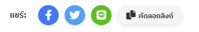

# ปลั๊กอินแชร์สำหรับ WordPress

**ปลั๊กอินแชร์** เป็นปลั๊กอิน WordPress ขนาดเล็กที่เพิ่มปุ่มแชร์สังคมไปยังโพสต์ของคุณ ด้วยปลั๊กอินนี้ ผู้ใช้ของคุณสามารถแชร์เนื้อหาของคุณได้ง่ายๆ บนแพลตฟอร์มโซเชียลมีเดียยอดนิยม เช่น Facebook, Twitter และ LINE และยังสามารถคัดลอกลิงก์ของโพสต์ได้เพียงคลิกเดียว

## คุณสมบัติ
- **ปุ่มแชร์ Facebook**: ช่วยให้ผู้ใช้สามารถแชร์เนื้อหาของคุณบน Facebook
- **ปุ่มแชร์ Twitter**: ช่วยให้ผู้ใช้สามารถแชร์เนื้อหาของคุณบน Twitter
- **ปุ่มแชร์ LINE**: แชร์เนื้อหาผ่านการส่งข้อความใน LINE
- **ปุ่มคัดลอกลิงก์**: ผู้ใช้สามารถคัดลอกลิงก์ของโพสต์เพื่อนำไปแชร์ด้วยตนเอง

## การติดตั้ง

ทำตามขั้นตอนเหล่านี้เพื่อติดตั้งและเปิดใช้งานปลั๊กอินแชร์ในเว็บไซต์ WordPress ของคุณ:

1. **ดาวน์โหลดปลั๊กอิน**: ดาวน์โหลดไฟล์ปลั๊กอิน ZIP จาก GitHub หรือจากแผงควบคุมของ WordPress
2. **อัปโหลดปลั๊กอิน**:
   - จากแผงผู้ดูแลระบบ WordPress ไปที่ `ปลั๊กอิน > เพิ่มใหม่`
   - คลิก `อัปโหลดปลั๊กอิน` แล้วเลือกไฟล์ปลั๊กอิน (`share-plugin.zip`) และทำการติดตั้ง
3. **เปิดใช้งานปลั๊กอิน**: หลังจากติดตั้งเสร็จ คลิกที่ `เปิดใช้งาน` เพื่อเปิดปลั๊กอินบนเว็บไซต์ของคุณ
4. **เพลิดเพลินกับปุ่มแชร์**: ปุ่มแชร์สังคมจะปรากฏที่ส่วนท้ายของโพสต์ทั้งหมดโดยอัตโนมัติ

## วิธีการทำงาน

เมื่อปลั๊กอินเปิดใช้งานแล้ว ปลั๊กอินจะเพิ่มปุ่มแชร์สังคมที่ส่วนล่างของทุกโพสต์ ปุ่มเหล่านี้จะช่วยให้ผู้เยี่ยมชมสามารถแชร์โพสต์บน Facebook, Twitter, LINE หรือคัดลอกลิงก์ได้โดยตรง

## ตัวอย่างหน้าจอ

นี่คือตัวอย่างหน้าจอของปลั๊กอินที่ปรากฏในโพสต์:

## การปรับแต่ง

ปลั๊กอินออกแบบมาให้ใช้งานง่าย แต่คุณสามารถปรับแต่งปุ่มและลักษณะของปุ่มด้วย CSS สไตล์เริ่มต้นใช้ไอคอน Font Awesome และคุณสามารถเพิ่มสไตล์ที่กำหนดเองในตัวปรับแต่งของ WordPress หรือในไฟล์ CSS ของธีมของคุณ

## ใบอนุญาต

ปลั๊กอินนี้ได้รับใบอนุญาตภายใต้ [MIT License](https://opensource.org/licenses/MIT)

## การสนับสนุน

หากคุณพบปัญหาหรือมีคำถาม สามารถเปิดปัญหาภายใน [GitHub repository](https://github.com/nakharinit/Share-Plugin)

## การมีส่วนร่วม

ยินดีต้อนรับการมีส่วนร่วม! คุณสามารถทำการ fork โค้ดจาก repository ทำการเปลี่ยนแปลงและส่ง pull request ได้
